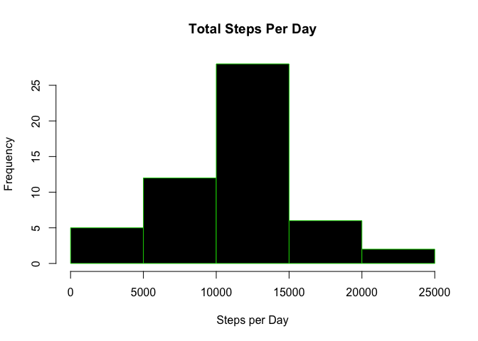
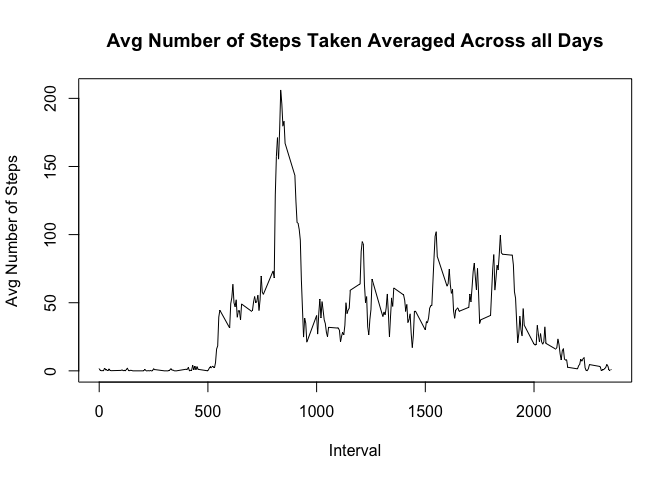
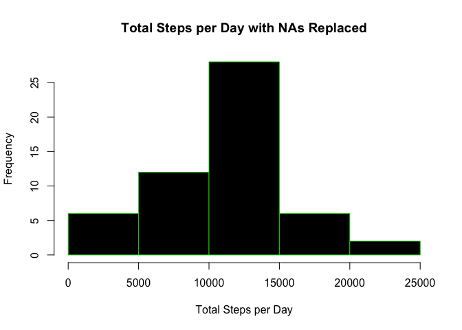
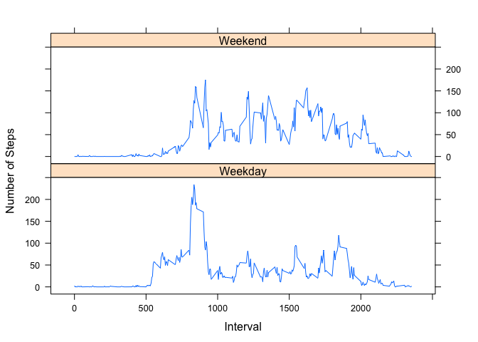

## Loading and preprocessing the data

In the following code, we load the data and remove any NA values.


```r
if(!file.exists("activity.csv")){
        tempfile <- tempfile()
        download.file("https://d396qusza40orc.cloudfront.net/repdata%2Fdata%2Factivity.zip",destfile=tempfile)
        unzip(tempfile)
        unlink(tempfile)
}
data <- read.csv("activity.csv",header=T)

removeNA <- na.omit(data)
```

## What is mean total number of steps taken per day?

Next, we calculate the total number of steps taken per day as well as create a histogram showing total steps taken per day.


```r
library(data.table)
```

```
## Warning: package 'data.table' was built under R version 3.4.4
```

```r
dt <- data.table(removeNA)

df <- as.data.frame(dt[,list(totalsteps = sum(steps)), by = c("date")])

hist(df$totalsteps,col=1,main="Total Steps Per Day",xlab="Steps per Day",border=3)
```

<!-- -->

Below are the calculated mean and median steps.

  Mean:

```r
mean(df[["totalsteps"]])
```

```
## [1] 10766.19
```
  Median:

```r
median(df[["totalsteps"]])
```

```
## [1] 10765
```

## What is the average daily activity pattern?

Next, we create a time series plot of the 5-minute interval and the average number of steps taken, averaged across all days.


```r
intervaldata <- aggregate(steps ~ interval, removeNA, mean)
plot(intervaldata$interval, intervaldata$steps, type='l',col=1, main = "Avg Number of Steps Taken Averaged Across all Days",xlab = "Interval", ylab = "Avg Number of Steps")
```

<!-- -->

Which interval, on average across all days, contains the maximum number of steps?


```r
maxinterval <- which.max(intervaldata$steps)
intervaldata [maxinterval,]
```

```
##     interval    steps
## 104      835 206.1698
```

## Imputing missing values

Calculate and report the number of missing values in the dataset.


```r
colSums(is.na(data))
```

```
##    steps     date interval 
##     2304        0        0
```
There are 2304 rows with missing data.

  We will replace the NA values with the mean of that interval. We will loop across the rows of the data frame. If the steps value is missing in that row, we find the value of the interval and assign the mean steps value for that interval. 


```r
for (i in 1:nrow(df)){
     if(is.na(data$steps[i])){
          interval_replace <- data$interval[i]
          row <- which(intervaldata$interval == 
          interval_replace)
          steps_replace <- intervaldata$steps[row]
          data$steps[i] <- steps_replace
     }
}
```

Next, we will make a histogram of the total number of steps taken per day with these replaces "NA" values.


```r
inserted <- aggregate(steps ~ date, data, sum)
hist(inserted$steps, col=1, border = 3, main="Total Steps per Day with NAs Replaced", xlab="Total Steps per Day")
```

<!-- -->

Below is the calculated mean and median of the new dataset.

  Mean:

```r
mean(inserted$steps)
```

```
## [1] 10567.29
```
  Median:

```r
median(inserted$steps)
```

```
## [1] 10682.5
```

The mean changed from 1.0766189\times 10^{4} to 1.0567294\times 10^{4}, a decrease of about 199.

The median changed from 10765 to 1.06825\times 10^{4}, a decrease of about 83.

## Are there differences in activity patterns between weekdays and weekends?

First, we create a new factor variable with two levels - weekday and weekend.


```r
day <- weekdays(as.Date(data$date))
level <- vector()
for (i in i:nrow(data)) {
if (day[i] =="Saturday"){
level[i] <- "Weekend"
} else if (day[i] == "Sunday") {
level[i] <- "Weekend"
} else { level[i] <- "Weekday"
}
}

data$level <- level
data$level <- factor(data$level)

stepsperlevel <- aggregate(steps ~ interval + level, data = data, mean)
names(stepsperlevel) <- c("interval","level","steps")
```

Next, we will create a panel plot containing a time series plot of the 5-minute interval and the average number of steps taken, across all weekdays or weekend days. 


```r
library(lattice)

xyplot(steps ~ interval | level, stepsperlevel, type = "l"
,layout = c(1, 2), xlab = "Interval",ylab = "Number of Steps")
```

<!-- -->
